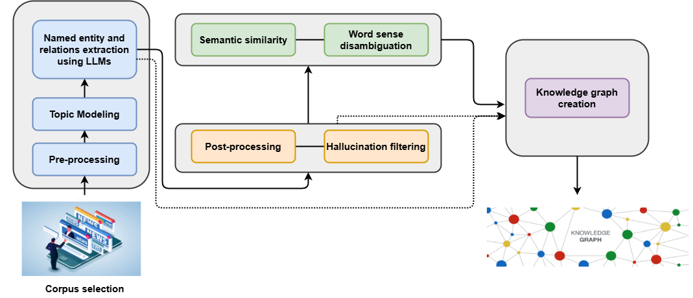

<div align="center">
    
</div>


<div align="center">
    <h1>Workflow for knowledge graph-construction using LLMs and metrics</h1>
</div>

This repository, KG-LLM-Metrics, provides a comprehensive workflow for building knowledge graphs (KGs) using large language models (LLMs) in a zero-shot approach. It includes methods for generating, evaluating, and optimizing knowledge graphs while leveraging a robust metrics framework that is designed to analyze the topological structure of the graph and assess the quality of the information relative to the original corpus, thereby achieving a more accurate and consistent representation of the extracted knowledge.

<h2 style="font-size: 2rem; margin-bottom: 20px;">Characteristics</h2>

The proposal is divided into nine sections: 

1) Corpus selection
2) Pre-processing
3) Topic modeling
4) Named entity and relations extraction using LLMs
5) Post-processing
6) Hallucination filtering
7) Semantic similarity
8) Word sense disambiguation
9) Knowledge graph creation

As shown in the following image

<div align="center">
    
</div>


<h2 style="font-size: 2rem; margin-bottom: 20px;">Metrics</h2>

The metrics used were the following:

1. Number of nodes and edges
2. Percentage of overlap and differences
3. Frequency of specific types of entities
4. Clustering coefficient
5. Density
6. Average degree
7. Percentage of hallucination
8. Redundancy
9. Contextual relevance

<h2 style="font-size: 2rem; margin-bottom: 20px;">Large Language Models</h2>

We use the following LLMs for knowledge extraction. Scripts allow you to process data in a DataFrame, generating a new column with the results of the LLM model. Make sure you meet the dependencies before running it.

Requirements

Python 3.9 or higher.
Libraries: <a href="https://ollama.com/">ollama</a>, pandas, gc, NVIDIA GPU of at least 16GB recommended

<h2 style="font-size: 2rem; margin-bottom: 20px;">Llama 3.1</h2

Model Configuration: Edit the model in ollama.chat to adjust it to your needs. For example, you can replace llama3.1 with any other supported model. For more information about the model, please consult <a href="https://ollama.com/library/llama3.1">here</a>

```python
def process_text(text):
    response = ollama.chat(model='llama3.1', messages=[....])
    return response['message']['content']

def process_df(df, text_column, output_column):
    results = []
    for index, row in df.iterrows():
        text = row[text_column]
        result = process_text(text)
        results.append(result)

        del text
        del result
        gc.collect()

        print(f"Procesado fila {index + 1}/{len(df)}")

    df[output_column] = results
    return df
```


<h2 style="font-size: 2rem; margin-bottom: 20px;">Gemma 2</h2>

Similar to the case of Llama 3.1. For more information about the model, please consult <a href="https://ollama.com/library/llama3.1](https://ollama.com/library/gemma2">here</a>

```python
def process_text(text):
    response = ollama.chat(model='gemma2', messages=[....])
    return response['message']['content']

def process_df(df, text_column, output_column):
    results = []
    for index, row in df.iterrows():
        text = row[text_column]
        result = process_text(text)
        results.append(result)

        del text
        del result
        gc.collect()

        print(f"Procesado fila {index + 1}/{len(df)}")

    df[output_column] = results
    return df
```


<h2 style="font-size: 2rem; margin-bottom: 20px;">GPT-4o</h2>

For this model, it is necessary to have an API Key to be able to process the information. For more information about the model, please consult <a href="https://huggingface.co/allenai/OLMo-7B](https://openai.com/index/hello-gpt-4o/">here</a>

```python

client = OpenAI(
    api_key="YOU API KEY")

input_csv = 'C:\Users\..'

output_csv = 'C:\Users\..'


def obtener_tripletas(texto):
    response = client.chat.completions.create(
        messages=[{"role": "user", "content": f"""....""",}],
        model="gpt-4o",
        #messages=[{"role": "user", "content": prompt}],
        max_tokens=750,
        n=1,
        stop=None,
        temperature=0.5,
    )

    tripletas_json = response.choices[0].message.content
    return tripletas_json
```

<h2 style="font-size: 2rem; margin-bottom: 20px;">OLMO</h2>

For more information about the model, please consult <a href="https://huggingface.co/allenai/OLMo-7B">here</a>

```python

from hf_olmo import OLMoForCausalLM, OLMoTokenizerFast  # pip install ai2-olmo
import torch
import pandas as pd
import gc

torch.random.manual_seed(0)
model = OLMoForCausalLM.from_pretrained(
    "allenai/OLMo-7B",
    #revision="step1000-tokens4B"
    device_map="cuda",
    torch_dtype="auto",
)

tokenizer = OLMoTokenizerFast.from_pretrained("allenai/OLMo-7B")

df = pd.read_csv('C:\Users\..')

pipe = pipeline(
    "text-generation",
    model=model,
    tokenizer=tokenizer,
)

generation_args = {
    "max_new_tokens": 1400,
    "return_full_text": False,
    "temperature": 0.7,  
    "do_sample": True,    
}

batch_size = 5  

for i in range(0, len(df), batch_size):
    batch = df[i: i + batch_size]
    total_rows = len(batch)
    
    for idx, row in batch.iterrows():
        text = row['texto_completo']  

        
        input_tokens = tokenizer.encode(text)
        if len(input_tokens) > 4096:
            print(f"Texto en fila {idx} excede la longitud máxima de tokens. Se truncará.")
            text = tokenizer.decode(input_tokens[:4096])  

        
        messages = [
            {"role": "system",
             "content": f"""..."""}
        ]

 
        output = pipe(messages, **generation_args)
```


<h2 style="font-size: 2rem; margin-bottom: 20px;">Licence</h2>

KG-LLM-Metrics is licensed under GPL-3.0 - see the LICENSE.md file for details.


